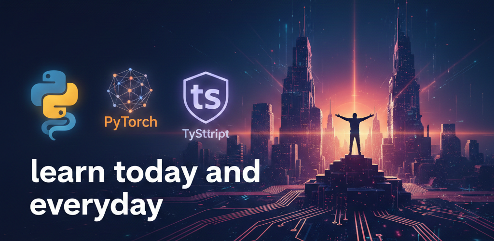

  
  
  # 🚀 Mohamed Gamal
  ### AI & Data Science Engineer | Full-Stack AI Developer
  
  
  
  

---

### 👨‍💻 About Me
I'm a passionate **AI & Data Science Engineer** focused on building intelligent systems that solve real-world problems. I bridge the gap between complex AI models and functional, user-centric applications.

- 🛠️ Currently architecting **DCMS** (Correspondence Management System) & **Basir**.
- 🎓 Completed Advanced Diploma in **AI & Data Science (AMIT – MCIT)**.
- 💡 Interested in **Vibe Coding**, Generative AI, and Computer Vision.

---

### 🛠️ Tech Stack

  
  
  
  
  
  

---

### 🚀 Featured Projects
| Project | Description | Tech Stack |
| :--- | :--- | :--- |
| **[DCMS Mobile](https://github.com/MohamedGamal-Ahmed/DCMS-Mobile-App)** | AI-powered Correspondence Management System. | TS, FastAPI, AI |
| **[Basir](https://github.com/MohamedGamal-Ahmed/Basir)** | Advanced Python-based AI project. | Python, ML |
| **[Face Mask Detection](https://github.com/MohamedGamal-Ahmed/Face-Mask-Detection)** | Real-time computer vision system using YOLOv5. | Python, YOLOv5 |
| **[Masar App](https://github.com/MohamedGamal-Ahmed/Masar-App)** | Personal Financial Management Tool. | TypeScript, Node.js |

---

### 📊 GitHub Stats

  
  

---

### ☕ Fun Facts
- **Debugging Power:** Powered by Coffee & Logic Puzzles.
- **Learning Style:** Build first, read documentation later.
- **Goal:** Making AI accessible and creative for everyone.
